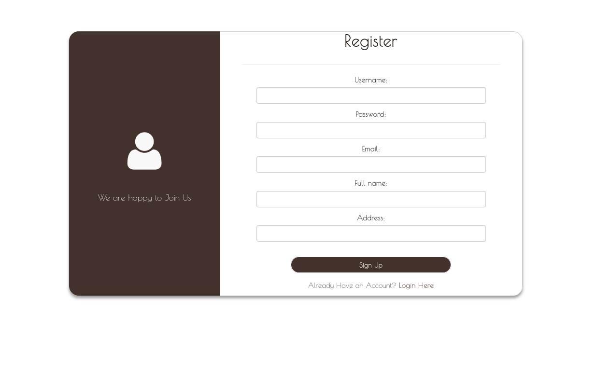

# Chocolicious App
## An ecommerce app to buy chocolates

A django based ecommerce app where users can buy different kinds of chocolates.


## Features

- Developed using Django, and Python
- Simple, fast, secured and easy to use application
- User Authentication & Management 
- Filtering & Searching Items By Category
- Adding & Removing Items From/To The Cart
- Cart Management
- Commercial & User Friendly Checkout Process Using Dynamic Form
- Order History & Summary
- Customized Default Django Admin Dashboard
- User Profile Management
- A real-time chat bot to help users with queries
- Can be hosted easily in cloud

## Tech

Chocolicious uses a number of open source projects to work properly:

- [Django] - Powerful Python Based Web Framework
- [Python] - a Powerful Programming Language


## Installation


To get this project up and running you should start by having Python installed on your computer. It's advised you create a virtual environment to store your projects dependencies separately. You can install virtualenv with

```
pip install virtualenv
```

Clone or download this repository and open it in your editor of choice. In a terminal (mac/linux) or windows terminal, run the following command in the base directory of this project

```
git clone https://github.com/bickkysahani/Chocolicious.git
cd Chocolicious

```

```
virtualenv venv
```

That will create a new folder `env` in your project directory. Next activate it with this command on mac/linux:

```
source env/bin/active
```

Then install the project dependencies with

```
pip install -r requirements.txt
```

Now you can run the project with this command

```
python manage.py runserver
```


## Screenshots
Homepage

Product Page

Cart Page

Checkout Page

Order Page

Order Summary Page

Login Page

Signup Page



